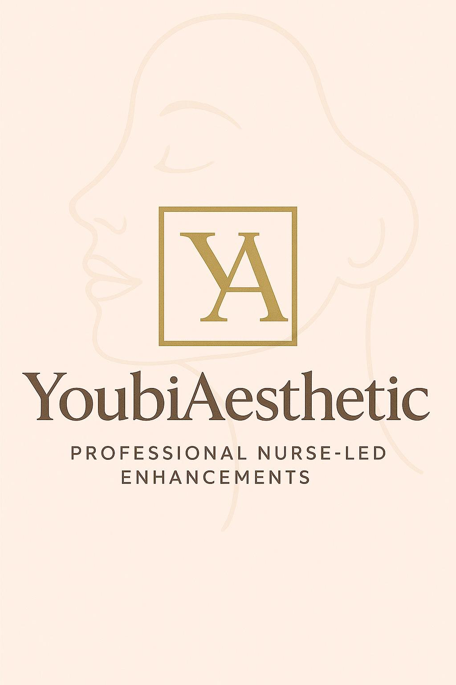

```html
# 🌐 YoubiAesthetic - Portfolio & Services

Ce dépôt contient le site web **YoubiAesthetic**, un portfolio professionnel présentant les services esthétiques.

## 📞 Contact
- 📧 Email : [Youbiaesthetic@gmail.com](mailto:Youbiaesthetic@gmail.com)  
- 💼 LinkedIn : [Profil LinkedIn](https://www.linkedin.com/in/audrey-youbi-8b11ba1ba)  
- 🌍 Portfolio en ligne : [Lien GitHub Pages](https://USERNAME.github.io/REPOSITORY/)  

---

## 🖼 Aperçu
Le site comprend :
- Une **navbar** fixe
- Une section **Accueil**
- Une section **Services & Tarifs**
- Une section **À propos**
- Une section **Contact**
- Un **footer** avec les réseaux sociaux

---

## 💻 Code HTML

```html
<!DOCTYPE html>
<html lang="en">
<head>
    <meta charset="UTF-8">
    <meta name="viewport" content="width=device-width, initial-scale=1.0">
    <title>YoubiAesthetic - Esthétique à Coventry</title>
    <link rel="stylesheet" href="styles.css">
</head>
<body>
    <!-- Navbar -->
    <nav class="navbar">
        <div class="logo">
            
        </div>
        <ul class="nav-links">
            <li><a href="#home">Accueil</a></li>
            <li><a href="#services">Services & Tarifs</a></li>
            <li><a href="#about">À propos</a></li>
            <li><a href="#contact">Contact</a></li>
        </ul>
    </nav>

    <!-- Accueil Section -->
    <section id="home" class="hero-section">
        <h1>Bienvenue chez YoubiAesthetic</h1>
        <p>Découvrez une expérience esthétique unique à Coventry.</p>
        <button onclick="window.location.href='mailto:Youbiaesthetic@gmail.com'">Prendre rendez-vous</button>
    </section>

    <!-- Services & Tarifs -->
    <section id="services">
        <h2>Nos Services & Tarifs</h2>
        <div class="service-list">
            <div class="service-item">
                
                <h3>LIP FILLER</h3>
                <ul>
                    <li>0.5ML: £100</li>
                    <li>1ML: £150</li>
                </ul>
            </div>
            <!-- Autres services ici -->
        </div>
    </section>

    <!-- À propos -->
    <section id="about">
        <h2>À propos de nous</h2>
        <p>Notre clinique offre des services d'esthétique haut de gamme dans un cadre moderne et accueillant.</p>
    </section>

    <!-- Contact -->
    <section id="contact">
        <h2>Contactez-nous</h2>
        <p>Email: <a href="mailto:Youbiaesthetic@gmail.com">Youbiaesthetic@gmail.com</a></p>
        <p>Téléphone: <a href="tel:+44 7404 555219">+44 7404 555219</a></p>
    </section>

    <!-- Footer -->
    <footer>
        <p>Suivez-nous sur les réseaux sociaux:</p>
    </footer>
</body>
</html>
```

```css
/* Reset de styles */
* {
    margin: 0;
    padding: 0;
    box-sizing: border-box;
}

body {
    font-family: Arial, sans-serif;
    background-color: #f4f4f4;
    color: #333;
    line-height: 1.6;
}

/* Navbar */
.navbar {
    position: fixed;
    top: 0;
    width: 100%;
    background-color: #333;
    padding: 10px 0;
    z-index: 1000;
}
.navbar .logo img {
    width: 120px;
    margin-left: 20px;
}
.navbar .nav-links {
    list-style: none;
    float: right;
    margin-right: 20px;
}
.navbar .nav-links li {
    display: inline-block;
    margin-left: 20px;
}
.navbar .nav-links a {
    color: white;
    text-decoration: none;
    font-size: 18px;
}

/* Hero Section */
.hero-section {
    background-color: #3399ff;
    color: white;
    text-align: center;
    padding: 50px 20px;
}
.hero-section h1 {
    font-size: 40px;
}

/* Services Section */
#services {
    background-color: #fff;
    padding: 50px 20px;
    text-align: center;
}
.service-item {
    background-color: #f4f4f4;
    border-radius: 10px;
    padding: 20px;
    margin: 10px;
}
```


